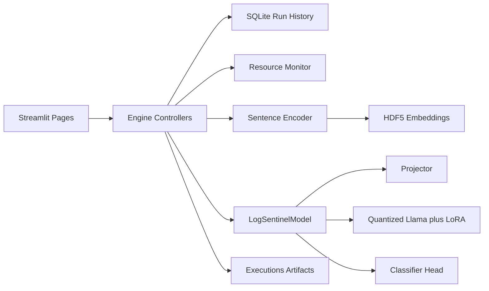

# LogSentinel

<<<<<<< HEAD
LogSentinel is now organized as a three-part monorepo:

- `backend/`: FastAPI orchestration, async job management, and SQLite-backed run history.
- `mlcore/`: Stateless machine-learning package with controllers, datasets, models, filesystem artifacts, and the headless CLI.
- `frontend/`: React + Vite control plane for launching jobs, polling live status, browsing runs, and visualizing `run_metrics.json` artifacts.

## Structure

```text
log-sentinel/
├── backend/
│   ├── api/             # FastAPI app, async job manager, routes, schemas
│   ├── utils/           # Backend-only utilities such as DatabaseManager
│   ├── config.py        # Backend shim for DB path + mlcore paths
│   ├── logsentinel.db   # SQLite run history
│   └── requirements.txt
├── mlcore/
│   ├── engine/          # Training and inference controllers
│   ├── utils/           # Stateless ML helpers
│   ├── datasets/        # Local datasets
│   ├── models/          # Cached / local model weights
│   ├── executions/      # Run outputs including run_metrics.json
│   ├── prepareData/     # Data preparation helpers
│   ├── cli.py           # Headless CLI with train / inference subcommands
│   └── config.py        # Stateless filesystem and hyperparameter config
├── frontend/
│   ├── src/
│   │   ├── services/    # API integration helpers
│   │   ├── hooks/       # Polling / UI control hooks
│   │   ├── pages/       # Dashboard, train, job, run details views
│   │   └── components/  # Shared React UI pieces
│   └── package.json
└── README.md
```

## Backend Setup

Python 3.11 is recommended. GPU-backed training still depends on a CUDA-compatible PyTorch install and the model stack already used in this repository.

The backend does not download models at runtime. It only validates that the required local model directories already exist under `mlcore/models` before it accepts training or inference work.

1. Create and activate a virtual environment.

```bash
=======
LogSentinel is a Streamlit-based workbench for log anomaly detection built around a hybrid pipeline: a sentence encoder turns raw log lines into dense vectors, a projector aligns those vectors to a quantized Llama hidden space, and a classifier predicts whether each log sequence is normal or anomalous. The repository is organized to keep long-running machine learning work away from the UI, make preprocessing explicit, and preserve every run as a reproducible artifact.

The current implementation is optimized for interactive experimentation on a single workstation. That design choice shows up everywhere in the codebase: controllers create execution folders and database records per run, background threads keep the Streamlit UI responsive, and preprocessing scripts live outside the runtime because they are heavy, dataset-specific ETL jobs rather than request-time logic.

## Documentation Map

- [engine/README.md](engine/README.md): Runtime orchestration, training phases, and inference flow.
- [pages/README.md](pages/README.md): Streamlit page responsibilities and UI execution model.
- [prepareData/README.md](prepareData/README.md): Offline dataset construction scripts and data contracts.
- [utils/README.md](utils/README.md): Shared infrastructure for data, models, monitoring, UI, and persistence.
- [CHANGELOG.md](CHANGELOG.md): Documentation and repository-level change history.

## Architecture Overview



## Why The Repository Is Structured This Way

- `pages/` is intentionally thin. Each page is responsible for input validation, launching work in a background thread, and rendering status updates. The expensive logic lives elsewhere so Streamlit reruns do not swallow application behavior.
- `engine/` owns orchestration. Training and inference are long, stateful workflows that need progress reporting, artifact management, cleanup, and metrics collection. Those responsibilities do not belong in UI code.
- `prepareData/` is separate because raw log corpora have different parsing rules and sessionization strategies. Treating preprocessing as standalone scripts keeps those assumptions visible and reproducible.
- `utils/` contains shared infrastructure rather than domain flow. Model loading, SQLite persistence, plotting, resource monitoring, and Streamlit state helpers are reused across pages and controllers.
- Runtime outputs live in generated directories such as `executions/`, `models/`, and `logsentinel_data/` so the repository code stays distinct from caches, checkpoints, and reports.

## Directory Guide

| Path | Significance | Why it exists |
| --- | --- | --- |
| `engine/` | Training and inference controllers, shared phase logic, and runtime datasets. | Keeps orchestration separate from Streamlit page code and makes the runtime reusable outside the UI. |
| `pages/` | Multipage Streamlit interface for training, inference, and history. | Maps directly to operator workflows while keeping each screen focused. |
| `prepareData/` | Offline parsing, windowing, and dataset-building scripts. | Raw log formats differ enough that preprocessing needs explicit, dataset-specific recipes. |
| `utils/` | Shared support services such as DB access, plotting, UI helpers, and model loading. | Prevents controller and page code from accumulating infrastructure details. |
| `datasets/` | Input datasets, usually organized as `datasets/<dataset_name>/`. | Central location for prepared CSVs consumed by the runtime. |
| `models/` | Local cache for the encoder and Llama backbone. | Avoids repeated downloads and gives the app stable local paths. |
| `executions/` | Per-run artifacts: plots, copied fine-tuned weights, predictions, and temp embeddings. | Makes every run inspectable after completion. |
| `logsentinel_data/` | Temporary caches such as `temp_models`. | Isolates transient runtime state from the source tree. |

## Runtime Flow

1. `app.py` sends the user directly to the training page, which acts as the default landing experience.
2. A page in `pages/` validates datasets and model availability, then starts a background thread and a queue-based callback loop.
3. A controller in `engine/` creates a database record and an execution directory for the run.
4. Raw sequence strings are normalized, chunked, embedded with the sentence encoder, and stored in HDF5 so the full embedding set does not need to stay in RAM.
5. `logsentinel_model.py` projects the encoder output into the Llama hidden space, prepends an instruction prompt, and uses a classifier head for anomaly prediction.
6. Metrics, plots, predictions, and resource-usage summaries are written back to disk and indexed in SQLite for the History page.

## Key Design Decisions

### Two-stage training

Training runs first adapt the projector and classifier, then perform broader LoRA-based fine-tuning. That split lowers the risk of destabilizing the backbone too early and makes memory usage more manageable on limited hardware.

### HDF5-backed intermediate datasets

Controllers write embedded sequences to HDF5 before training or inference. This is deliberate: large log corpora can exceed RAM if all dense vectors stay resident in memory, and the HDF5 layer allows the later model stages to stream batches safely.

### Quantized Llama plus LoRA

`utils/model_loader.py` loads the Llama backbone in 4-bit mode and `logsentinel_model.py` applies LoRA adapters. The goal is to keep the backbone expressive enough for sequence reasoning without requiring the memory profile of full fine-tuning.

### Background execution from Streamlit

The pages use threads and `st.session_state` instead of running the full pipeline inline. Streamlit reruns the script often; the queue-based pattern keeps the UI responsive while long jobs continue in the background.

### Dataset-specific preprocessing scripts

The scripts under `prepareData/` are intentionally closer to research notebooks than to a generic CLI. Several contain local paths or dataset-specific line ranges because they preserve the exact preparation recipes used to derive training corpora from very large raw logs.

## Data Contract

- A dataset folder is expected under `datasets/<dataset_name>/`.
- `train.csv` is required for the training page.
- `test.csv` is required for the inference page and for final evaluation during training.
- Most preparation scripts also emit `validation.csv`, but the current training controller derives its own 90/10 train-validation split from `train.csv` at runtime.
- The runtime expects two columns: `Content` and `Label`.
- `Content` stores one sequence as log lines joined by ` ;-; `.
- `Label` uses `0` for normal and `1` for anomalous.

## Top-Level Files

| File | Purpose |
| --- | --- |
| `app.py` | Streamlit bootstrap that sets the page config and redirects to the main training page. |
| `config.py` | Central path definitions, default models, and dataset-specific hyperparameter overrides. |
| `logsentinel_model.py` | Hybrid model that projects encoder embeddings into the Llama space and classifies the resulting sequence representation. |
| `download_models.py` | Downloads the default encoder and Llama backbone into `models/`, including gated-model auth checks. |
| `dataset_analyzer.py` | Computes dataset-level counts and projected epoch sizes for prepared CSVs. |
| `directory_scanner.py` | Generates a markdown snapshot of repository code and structure for auditing or sharing. |
| `system_spec.py` | Reads CPU, RAM, GPU, CUDA, and driver details for environment checks. |
| `run_training.py` | Older CLI-oriented training entry point that is secondary to the Streamlit-driven workflow. |

## Setup

### Prerequisites

- Python 3.11 is recommended.
- NVIDIA CUDA support is strongly recommended for training and practical inference speed.
- Access to the gated `meta-llama/Llama-3.2-1B` model is required if you want to use the default backbone.

### Installation

```bash
git clone https://github.com/kmkrofficial/log-sentinel
cd log-sentinel
>>>>>>> 577fdd4 (docs: readme for indivdual folders)
python -m venv .venv
source .venv/bin/activate
```

<<<<<<< HEAD
Windows:

```bash
.\.venv\Scripts\activate
```

Linux / macOS:

```bash
source .venv/bin/activate
```

2. Install PyTorch for your CUDA/runtime target.

3. Install backend dependencies.

```bash
cd backend
pip install -r requirements.txt
```

4. Start the FastAPI server.
=======
Install a CUDA-compatible PyTorch build that matches your environment. The repository was written around PyTorch 2.3.1 with CUDA 12.1.

```bash
pip install torch==2.3.1 torchvision==0.18.1 torchaudio==2.3.1 --index-url https://download.pytorch.org/whl/cu121
pip install -r requirements.txt
```

Optional but recommended on supported systems:

```bash
pip install flash-attn --no-build-isolation
```

If you are using the default Llama backbone, authenticate first:

```bash
huggingface-cli login
python download_models.py
```

## Running The Application
>>>>>>> 577fdd4 (docs: readme for indivdual folders)

```bash
uvicorn api.main:app --reload
```

<<<<<<< HEAD
The backend will be available at `http://localhost:8000`.

If the required models are missing, training and inference endpoints return a validation error telling you to complete setup first.

## ML Core CLI

The ML package can also be run without the API or frontend.

Training:

```bash
python -m mlcore.cli train --dataset-name BGL
```

Inference:

```bash
python -m mlcore.cli inference --model-run-path mlcore/executions/<run-name> --dataset-name BGL
```

Optional training overrides:

```bash
python -m mlcore.cli train --dataset-name BGL --hyperparameters-json '{"micro_batch_size": 16}'
```

## Frontend Setup

From the repository root:

```bash
cd frontend
npm install
```

Start the Vite development server:

```bash
npm run dev
```

The frontend defaults to `http://localhost:5173` and talks to `http://localhost:8000/api`.

Optional override:

```bash
VITE_API_BASE_URL=http://localhost:8000/api
```

## Running Both Servers

Use two terminals.

Terminal 1:

```bash
cd backend
uvicorn api.main:app --reload
```

Terminal 2:

```bash
cd frontend
npm run dev
```

## Scripts

The repository now includes a dedicated [scripts](scripts) folder for setup, deployment prep, and local execution management.

- [scripts/setup.ps1](scripts/setup.ps1): verifies Python 3.11, creates or reuses `.venv`, verifies the virtual environment interpreter, lets you choose `frontend`, `mlcore`, `backend-mlcore`, or `all`, installs dependencies, and builds the frontend when requested.
	It can also install the local Flash Attention wheel from `mlcore/` and optionally download the required Hugging Face models into `mlcore/models`.
- [scripts/start.ps1](scripts/start.ps1): starts `backend`, `frontend`, or `all`.
- [scripts/stop.ps1](scripts/stop.ps1): stops `backend`, `frontend`, or `all`.
- [scripts/restart.ps1](scripts/restart.ps1): restarts `backend`, `frontend`, or `all`.

Examples:

```powershell
PowerShell -ExecutionPolicy Bypass -File .\scripts\setup.ps1
PowerShell -ExecutionPolicy Bypass -File .\scripts\start.ps1 all
PowerShell -ExecutionPolicy Bypass -File .\scripts\stop.ps1 backend
PowerShell -ExecutionPolicy Bypass -File .\scripts\restart.ps1 frontend
```

To prepare the Python side and explicitly keep model downloads disabled during setup:

```powershell
PowerShell -ExecutionPolicy Bypass -File .\scripts\setup.ps1 -Profile backend-mlcore
```

During `mlcore`, `backend-mlcore`, or `all` setup, the script can:

- install the local Flash Attention wheel from `mlcore/flash_attn-2.8.2+cu128torch2.8-cp311-cp311-win_amd64.whl` when available
- prompt for Hugging Face authentication and download the required models into `mlcore/models`

That is the intended place for model provisioning. The frontend never provisions models, and the backend only validates their presence.

The scripts store local process state under `scripts/.runtime/`, which is ignored by Git.

## Current Frontend Surface

- Dashboard view: lists historical runs from `GET /api/runs`.
- Start Run view: selects a dataset from `GET /api/datasets`, submits `POST /api/train`, then redirects into live polling.
- Live Progress view: polls `GET /api/status/{job_id}` every 3 seconds until the job reaches a terminal state.
- Run Details view: loads `GET /api/runs/{run_id}` and renders training loss, RAM/VRAM series, and anomaly score distributions from `run_metrics.json`.

## API Notes

Key backend endpoints:

- `GET /api/datasets`
- `GET /api/models`
- `GET /api/runs`
- `GET /api/runs/{run_id}`
- `POST /api/train`
- `POST /api/inference`
- `GET /api/status/{job_id}`

The backend now owns SQLite persistence. `mlcore/` does not import the database layer.
The backend also does not provision models. It validates model presence before starting ML work.

## Operational Note

`ACTIVE_JOBS` is currently in-memory inside the FastAPI process. Live job state will be lost if the backend process restarts. That matches the current refactor phase, but it is not a durable job queue.

When the managed backend process is stopped through the scripts, any unfinished application-started jobs are marked `FAILED` during FastAPI shutdown. CLI-driven `mlcore` runs remain independent because they do not execute inside the backend process.
=======
The Streamlit UI provides three operator-facing workflows:

- Train and evaluate a model against a prepared dataset.
- Run inference or evaluation using a saved `output_model` directory.
- Review historical runs, metrics, artifacts, and hardware usage.

## Outputs And Persistence

- `logsentinel.db` stores run metadata, status, hyperparameters, and summary metrics.
- `executions/<nickname>/` stores plots, copied fine-tuned weights, predictions, and temporary artifacts for each run.
- `models/` stores cached model files downloaded from Hugging Face.
- `logsentinel_data/` stores transient support data such as temporary model caches.

## Changelog

Repository-level documentation changes are tracked in [CHANGELOG.md](CHANGELOG.md).
>>>>>>> 577fdd4 (docs: readme for indivdual folders)
