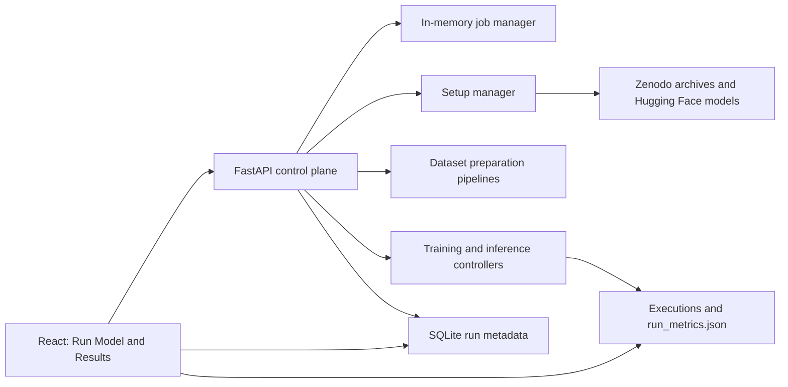

# LogSentinel

LogSentinel is a local control plane for supervised log anomaly detection. It combines a React workflow UI, a FastAPI job API, and a reusable Python ML core that provisions source datasets, prepares supervised splits, trains a hybrid encoder-plus-Llama model, and preserves run artifacts for later inspection.

The primary workflow is intentionally ordered:

1. **Configuration Setup** verifies the workstation, datasets, model cache, storage, and runtime dependencies.
2. **Data Preparation** turns verified raw archives into `train.csv`, `validation.csv`, and `test.csv` files.
3. **Model Training** runs final pre-checks before training or evaluating a model.

The browser keeps active setup, preparation, training, and inference jobs visible while users move between the workflow and results history.

## Architecture



| Area | Responsibility |
| --- | --- |
| [backend/README.md](backend/README.md) | FastAPI setup/status, preparation, training, inference, persistence, and job APIs. |
| [mlcore/README.md](mlcore/README.md) | Model runtime, setup catalog, provisioning manager, and filesystem contracts. |
| [mlcore/prepareData/README.md](mlcore/prepareData/README.md) | Dataset-specific preparation strategies and output format. |
| [frontend/README.md](frontend/README.md) | Run Model stepper, Results area, persistent job state, and browser API client. |
| [scripts/README.md](scripts/README.md) | Cross-platform bootstrap and Windows process-management helpers. |

## Run Model Workflow

Open the app at `/run`. The primary navigation has exactly two sections:

- **Run Model**: the gated Configuration Setup -> Data Preparation -> Model Training workflow.
- **Results**: current application activity plus the historical training and inference ledger.

Legacy `/train`, `/data-prep`, and `/inference` URLs redirect to the relevant workflow step. Direct URLs cannot bypass a locked step; the backend repeats the same checks before accepting a training or inference request.

### Step 1: Configuration Setup

The setup inventory checks:

- selected archive/raw/prepared state for every supported dataset
- local sentence encoder and Llama model assets
- free disk space and writable setup paths
- Python/backend packages
- CUDA device, BF16 support, and FlashAttention 3 availability
- bitsandbytes CUDA binary compatibility
- Linux Triton prerequisites such as `Python.h` and `gcc`
- whether the backend has an `HF_TOKEN`, without exposing its value to the browser

Provisioning runs as a background setup job. Downloads are resumed when possible, validated by size and Zenodo MD5 checksum, extracted with ZIP/TAR path-traversal protections, and promoted atomically into `datasets/<id>/raw/`.

### Step 2: Data Preparation

Preparation writes the controller contract beside each source folder:

```text
datasets/<dataset-id>/
├── raw/                 # verified extracted source assets
├── train.csv
├── validation.csv
└── test.csv
```

Each split uses:

```text
Content,Label
"log line 1 ;-; log line 2",0
```

Supported strategies are:

| Dataset | Preparation policy |
| --- | --- |
| `BGL` | Streaming fixed 100-line chronological windows with 80/10/10 splits. |
| `HDFS_v1` | Sessions grouped by `BlockId`, labeled from `anomaly_label.csv`, and staged through temporary SQLite. |
| `Thunderbird` | Existing reproducible 10-million-line slice, 100-line windows, and 10x anomaly oversampling; advanced bounds are constrained in the UI. |
| `Hadoop` | Download and inspect source assets; prepare only when an approved source with `Content` and `Label` is detected. It remains blocked rather than inventing labels. |

Replacing managed raw assets invalidates generated splits, preventing stale `train.csv` or `test.csv` files from reaching training.

### Step 3: Model Training and Evaluation

Only prepared datasets reach this step. Training and inference run a final pre-check that validates the selected splits, model assets, execution storage, GPU environment, FlashAttention 3, bitsandbytes, Triton requirements, and inference checkpoints.

Failures return a full structured report through the API and keep execution disabled until resolved.

## Initial Setup

Python 3.11 is recommended. Node.js is required for the frontend. GPU-backed training requires a CUDA-compatible PyTorch installation and the model/runtime requirements surfaced by Configuration Setup.

### Cross-Platform Bootstrap

Inspect configuration without modifying files:

```bash
python scripts/bootstrap.py --check
```

Download, checksum-verify, and safely extract all requested Zenodo datasets:

```bash
python scripts/bootstrap.py --datasets all
```

The current catalog is pinned to Zenodo record `8196385`:

- `BGL.zip`
- `HDFS_v1.zip`
- `Hadoop.zip`
- `Thunderbird.tar.gz`

The archives total roughly 2.26 GB compressed; Thunderbird alone is roughly 2.0 GB compressed. Ensure sufficient disk space before provisioning all assets.

Install application-level dependencies and provision all catalog assets:

```bash
python scripts/bootstrap.py --install-python-deps --install-frontend-deps --all
```

Set `HF_TOKEN` first when using `--all`, because it includes the gated Llama model.

### Gated Model Download

The default Llama model is gated. Accept its Hugging Face access terms, then set `HF_TOKEN` in the backend environment. The browser never receives or stores this token.

```bash
export HF_TOKEN="your-token"
python scripts/bootstrap.py --models
```

### Windows Helper

The PowerShell helper creates or reuses the Python 3.11 virtual environment, installs dependencies, and delegates asset provisioning to the same Python bootstrap core:

```powershell
PowerShell -ExecutionPolicy Bypass -File .\scripts\setup.ps1
```

## Running the Stack

Start the backend:

```bash
python -m uvicorn api.main:app --app-dir backend --host 127.0.0.1 --port 8000
```

Start the frontend in a second terminal:

```bash
cd frontend
npm install
npm run dev -- --host 127.0.0.1 --port 5173
```

Open:

- Run Model: `http://127.0.0.1:5173/run`
- Results: `http://127.0.0.1:5173/results`
- API docs: `http://127.0.0.1:8000/docs`

Windows users can also use:

```powershell
PowerShell -ExecutionPolicy Bypass -File .\scripts\start.ps1 all
PowerShell -ExecutionPolicy Bypass -File .\scripts\stop.ps1 all
PowerShell -ExecutionPolicy Bypass -File .\scripts\restart.ps1 all
```

## API Surface

| Endpoint | Purpose |
| --- | --- |
| `GET /api/setup/status` | Configuration inventory, asset state, disk, token presence, and runtime checks. |
| `POST /api/setup/provision` | Start a background setup job for selected catalog datasets/models. |
| `GET /api/data-prep/status` | Preparation eligibility and blockers for catalog datasets. |
| `POST /api/data-prep` | Start a supported dataset preparation job. |
| `POST /api/pre-check` | Run training or inference readiness checks. |
| `POST /api/train` | Start a checked training job. |
| `POST /api/inference` | Start a checked evaluation/inference job. |
| `GET /api/status/{job_id}` | Poll live job progress and logs. |
| `GET /api/runs` | Read historical run summaries. |
| `GET /api/runs/{run_id}` | Read run metadata and detailed artifact metrics. |

## Validation

Run the setup and preparation regression tests:

```bash
PYTHONPATH=backend:. .venv/bin/python -m unittest discover -s backend/tests -v
```

Build the frontend:

```bash
cd frontend
npm run build
```

## Operational Constraints

- Active jobs live in the FastAPI process. Restarting the backend marks unfinished API-managed jobs as failed.
- Dataset/model provisioning is idempotent and skips already verified assets unless `--force` is used.
- `--force` replaces managed raw assets or model snapshots. It invalidates prepared split files for affected datasets.
- The setup UI reports system-level requirements but does not silently perform privileged OS package installation.
- The current workstation reports bitsandbytes CUDA 13.2 and Python development-header blockers during runtime checks. Resolve those before Step 3 can start model execution.

Repository-level changes are tracked in [CHANGELOG.md](CHANGELOG.md).